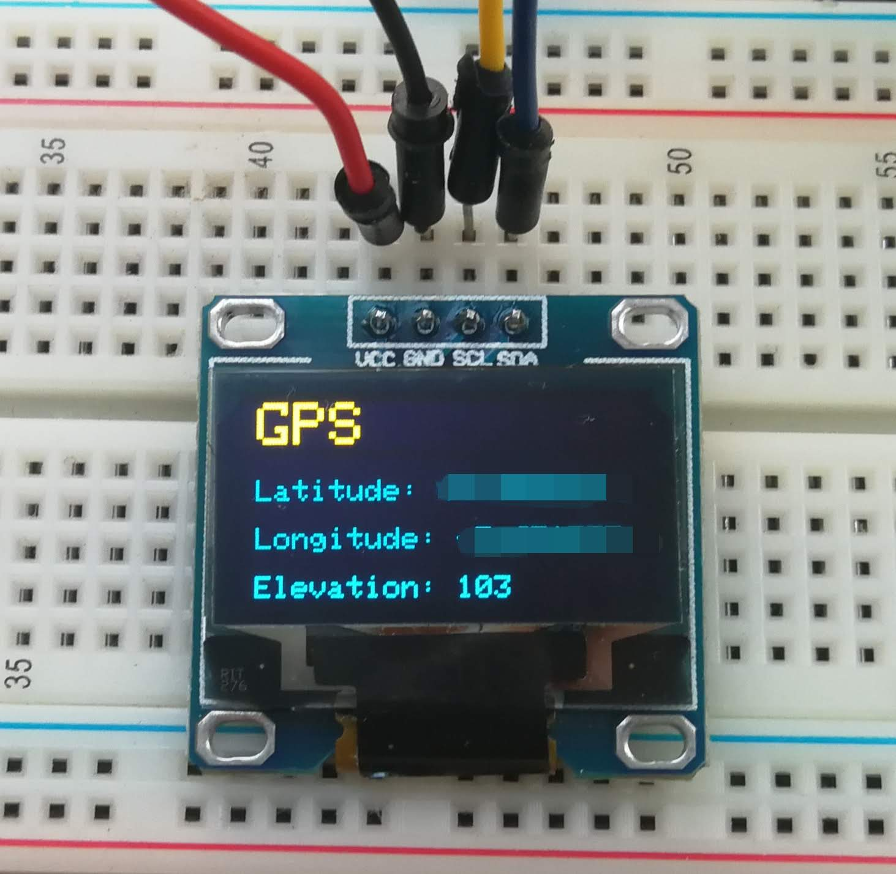
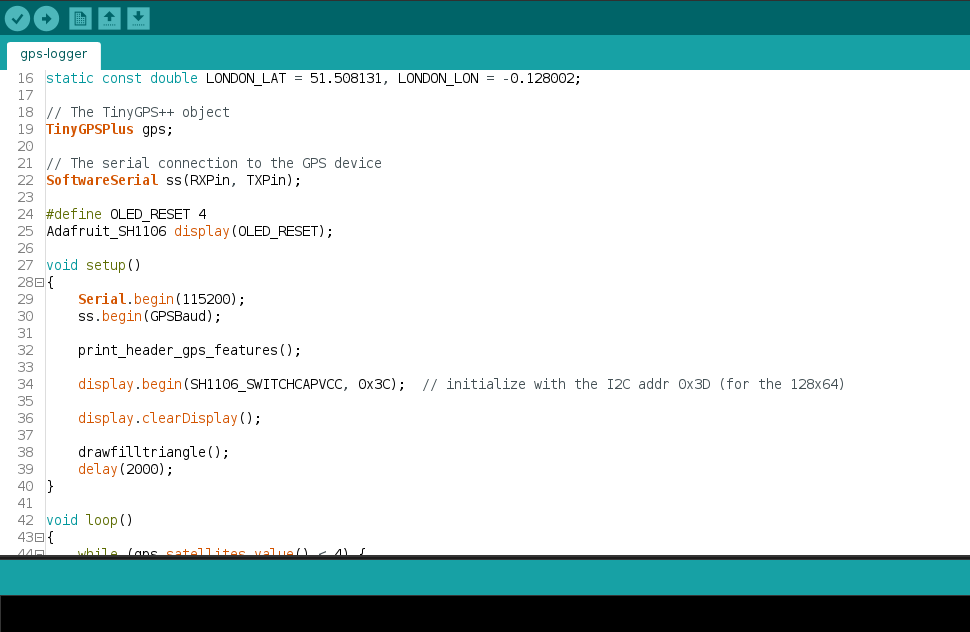
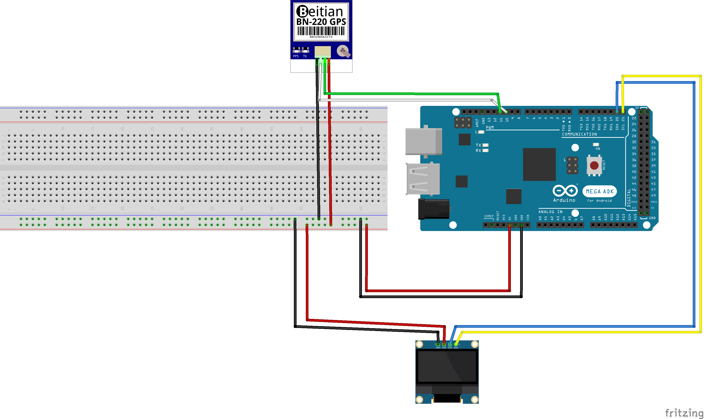

# GPS Logger

## Description
An Arduino project to build a GPS logger with an OLED display
 

## Code:

The  for Arduino IDE

## Dependencies

This project needs three dependencies:

- [SoftwareSerial.h](http://www.arduino.cc/en/Reference/SoftwareSerial) included in Arduino IDE
- [TinyGPS++](https://github.com/mikalhart/TinyGPSPlus)
- [Adafruit_SH1106](https://github.com/wonho-maker/Adafruit_SH1106)

## Schema:

Get the fritzing schema and start your own project:

## Custom fritzing parts:

If you want to design your own board get the [GPS module part](parts/Beitian_BN-220_GPS.fzpz)

## Parts
Find the parts to build the project: [parts](parts.md  "Components to build project")

## Credits

Mostly, gps-logger.ino was build based on FullExample for TinyGPS++

## Collaboration

If you try this project, feel free to open an issue if you get blocked or want to extend it