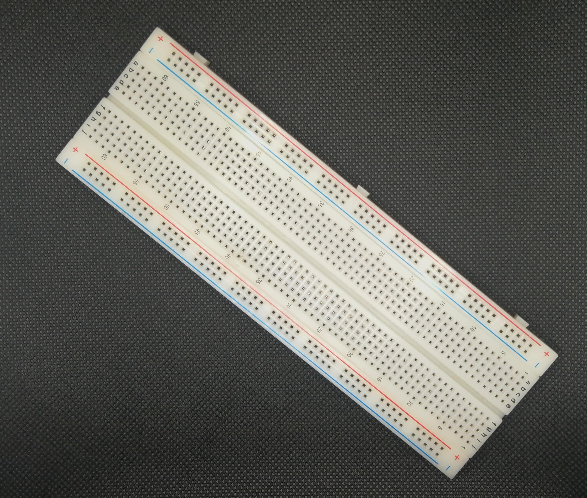

#Components:

- Arduino board:
    You can choose any Arduino board, for this project I choose Arduino Mega
    
    There's too a complete kit to play around (this is the one I own)
    
- USB Cable:
    Get yourself a long usb cable to be able to put your board near to a window!
    
- GPS Module:
    This cheap GPS module works really well and comes with dupont cables
    
    
- OLED display:
    A simple OLED 128x64. Yellow header and blue for the rest
    
- Protoboard:
    Until you go to production get a protoboard and connect all easily!
    
- Dupont cables:
    Get them male-to-male female-to-male and speed up your setup
    
